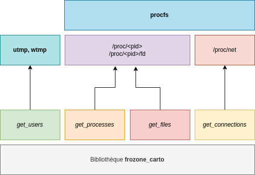
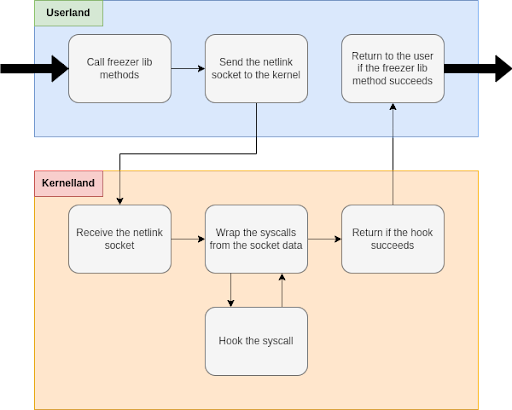
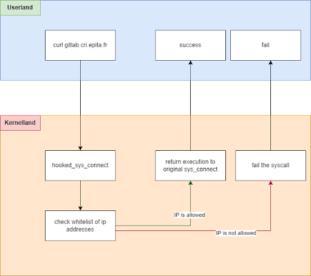

========================================================================================================================
Server Freezer: Un démon Linux pour cartographier et geler la configuration d’un OS
========================================================================================================================

:Auteurs: Kenji Gaillac, Erfan Hormozizadeh, Styvell Pidoux, Michel San, Valentin Seux, Théophane Wallerich

.. image:: ../img/EPITA.png
        :scale: 500

.. image:: ../img/logo_apprenti.png
        :scale: 400

.. contents::

.. section-numbering::

Préambule
==========

Ce document contient les principaux éléments relatifs à notre projet de fin d’études dans le cadre de notre formation en apprentissage à l’EPITA.
Il contient une brève présentation du sujet ainsi qu’un état de l’art scindé en plusieurs parties. Il contient également les spécifications techniques de l’outil développé et enfin une conclusion décrivant l’avancement, la maturité du projet et les difficultés rencontrées.

Introduction
============

L’objectif du projet FREEZER est de développer un démon configurable de cartographie d’une machine Linux (serveur, PC utilisateur, serveur embarqué type Raspberry Pi) qui permette de geler la configuration de cette machine, c’est-à-dire d’empêcher la création de nouvelles ressources (processus, connexion réseau, ouverture de fichier, etc.) tout en conservant le comportement existant. Il s'agit en fait de créer une whitelist de ces ressources : fichiers, connexions autorisées, processus sur la machine et de restreindre son utilisation a cette seule whitelist. Il permet également de bloquer une ou plusieurs ressources pour un ou plusieurs utilisateurs.

 Ce mécanisme va se découper en deux parties distinctes :

- la cartographie : permet de lister tous les éléments importants d’une configuration d’une machine spécifique. Il s’agit en quelque sorte de prendre un instantané du système d’exploitation, permettant de relever des divergences entre le comportement mesuré et le comportement attendu.

- le "freezer" : permet de geler le système en l'état, c’est-à-dire empêcher toute divergence par rapport à la configuration actuelle en bloquant toute création ou accès aux ressources.

Objectifs de la solution
========================

Les applications et les objectifs sont multiples étant donné qu'il s'agit d'une bibliothèque en deux modules, chaque module pouvant avoir divers usages.

Monitorer le système
++++++++++++++++++++

La génération d'un fichier d'information simple et concis permet un d'avoir un aperçu complet de l'activité sur la machine. On pourrait alors imaginer un outil se basant sur notre bibliothèque et qui permettrait de générer des logs de l'activité de la machine. Notez que la bibliothèque ne permet pas le monitoring de performance ou d'état de santé de la machine mais seulement des ressources en cours d'utilisation par celle-ci.

Mandatory Access Control: bloquer même l'utilisateur `root`
+++++++++++++++++++++++++++++++++++++++++++++++++++++++++++

La plupart des OS mainstream sont basés sur le modèle DAC (Discretionary Access Control). Cela permet de définir notamment des droits sur des fichiers, un utilisateur possédant un fichier est autorisé à écrire et à modifier les permissions de celui-ci. Cependant il s'agit d'un modèle dit discrétionnaire, c'est-à-dire qu'il confère le pouvoir à quelqu'un de décider. L'utilisateur `root`, qui possède tous les droits, n'est pas contraint pas la politique de contrôle d'accès. Cela peut notamment poser problème lors de la compromission d'un système si l'attaquant dispose d'un accès `root` directement ou s’il a la possibilité d'élever ses privilèges il va pouvoir disposer d'une liberté totale sur le système.

Il existe un autre modèle, qui viens seulement en tant que surcouche de l'OS que l'on appel MAC (Mandatory Access Control) qui permet de renforcer la politique de sécurité. Les contrôle d'accès y sont obligatoires, même l'utilisateur root ne peut les contourner. Une fois que la politique est en place, les utilisateurs ne peuvent pas la modifier même s’ils ont les privilèges root. Les protections sont indépendantes des propriétaires.

Évidemment il y a toujours un moyen de bypass cette solution pour qui voudrait vraiment le faire, mais cela force l'attaquant a réévaluer sa méthode d'attaque, l'accès root n'étant pas synonyme de plus haut niveau de privilège il s'agit d'un utilisateur comme les autres.

A l'origine le renforcement des politiques de contrôle d'accès a été largement démocratisé par le projet SELinux conçu par la NSA et confié à la communauté open source en 2000.

Mitiger une attaque
+++++++++++++++++++

Notre module kernel peut également permettre de bloquer des ressources spécifiques indépendamment, ce qui peut permettre de mitiger une attaque en temps réel. En bloquant toutes les connexions de la machine pour rompre la connexion avec un éventuel serveur de commande et de contrôle (C2C) par exemple.

Geler une infrastructure
++++++++++++++++++++++++

Cela sert notamment à s'assurer qu'une machine ou une infrastructure de machine suit uniquement un comportement défini. Le développement d'un outil simple et léger se révèle très intéressant s’il peut s'appliquer à du hardware simple tel qu'un Rapsberry Pi ou de l'IoT en général. En particulier car la sécurité est faible dans ce genre d'environnement. Un gel des connections sur du matériel IoT en général permettrais d'éviter l'utilisation de ce matériel dans des attaques DDOS (Déni de Service Distribué).

Faciliter le travail de Forensic
++++++++++++++++++++++++++++++++

Dans le cas de la détéction d'une anomalie sur une machine, le gel complet peut facilter le travail de Forensic puisqu'il permet de bloquer la machine dans l'état précis ou elle est au moment du gel. Cela permet de récuper un dump mémoire correspondant a une periode exact dans le temps.

État de l’Art
=============

Ce projet de démon Linux de cartographie système est un projet intimement lié aux systèmes d’EDR/XDR/IDS et de monitoring de système. Il est également très similaires en termes de fonctionnalités proposées par certains patchs du noyau Linux pour le renforcement de la sécurité.

Dans un premier temps, la partie cartographie est largement couverte par un ensemble de solutions open sources testées et approuvées depuis un certain nombre d’années.

La partie Freezer quant à elle, reste plus "inexplorée". Il peut s'agir d'un patch de sécurité supplémentaire du noyau Linux ou d'un système d’EDR (Endpoint Detection & Response).

Solutions de cartographies
++++++++++++++++++++++++++

Tout d'abord la cartographie, il s'agit d'obtenir une vue globale d'un OS, l'état global du système à un instant T.
Comme explicité précédemment la cartographie des systèmes Linux est une méthode bien maitrisée et éprouvée depuis des années.

On pense tout de suite aux outils de monitoring comme outils de cartographie, ils peuvent être locaux, de façon à obtenir un aperçu de sa propre machine, ou peuvent fonctionner avec un serveur central permettant d'obtenir une vue global d'un ensemble de machine.
Néanmoins nous cherchons ici à pouvoir définir ensuite un modèle basé sur la cartographie réalisée, et nous voulons un outil simple et léger, la plupart des solutions de monitoring sont surtout orientées performances et peuvent être lourde à mettre en place.

Le patch Linux GR security propose une fonctionnalité intéressante de génération automatique d'ACL (Learning mode) qui permet de lister les différentes utilisations de ressources légitimes afin de créer une whitelist pour la partie blocage. C'est précisément ce que nous cherchons à faire dans ce projet.

Monitoring
##########

Distribué
---------

Zabbix [https://github.com/zabbix/zabbix]

C'est une solution de monitoring open source qui va permettre également une récupération d’informations d'OS multiples, pour créer des dashboards et superviser une infrastructure technique, cette solution est cependant conçue majoritairement pour la remontée d'alerte en temps réel.

Local
-----

Il existe également d’autres solutions de monitoring système plus légères, fonctionnant en local sur la machine.

Linux Dash (Graphical web interface) : [https://github.com/afaqurk/linux-dash]

IDS
###

Nous pouvons également citer l’ensemble des IDR (Incident Detection System) et EDR (Endpoint Detection & Response). Des mécanismes de cyberdéfense apparus plus récemment dans l’histoire.

Ces deux mécanismes intègrent des solutions de détection de menaces dites 'Anomaly Based' qui vont donc nécessiter un monitoring précis du système protégé et donc une cartographie de celui-ci. Nous effectuons bien la distinction avec les systèmes 'Signature Based' qui ne nécessitent pas de cartographier le système et nous nous concentrons ici sur les IDS dits 'Host Based' (HIDS).

Lib
###

Psutil [https://github.com/jmigot-tehtris/psutil] : C'est un outil écrit en Python (il existe un équivalent Rust). C'est une bibliothèque extrêmement complète et facile à utiliser qui couvre tous les besoins de cartographie incluant même les performances et les metrics hardware.

Extension de Kernel
###################

Le module GR Security une extension pour le kernel Linux qui en augmente sa sécurité, présente une fonctionnalité de cartographie et de gel comme nous le verrons dans la partie suivante. Il s’agit d’un patch à appliquer au kernel et qui va lui apporter des fonctionnalités supplémentaires, notamment les Mandatory ACL.
GR Security possède une fonctionnalité très intéressante qu’ils appellent le Learning Mode et qui permet, en analysant l’activité sur une machine, de définir une ACL précise et restrictive. C'est en fait une cartographie des ressources permettant la création d'une whitelist utilisée dans la partie "blocage" de ressources.

GR Security : [https://github.com/linux-scraping/linux-grsecurity]

Nous pourrions continuer cette liste avec une multitude de solutions utilisant le même concept de cartographie système. Il est relativement facile de trouver des solutions open source pour ce type d’analyse, nous nous contenterons donc de l’open source pour la partie cartographie.
Un des membres du groupe travaille chez Interact Software, qui cartographie également des ressources sous Windows, nous le rajoutons donc à cette liste mȇme si ce n'est pas de l'open source.

Tableau
#######

+-----------------------------+--------------------------------+--------------------+-------------------------+------------------+------------------------------+-----------------------------+------------------+-----------------------------------------+----------------------------+
| Name                        | Type                           | Lang               | OPEN/COMMERCIAL         | get  users       | get  processes               | get connections             | get  files       | Others                                  | OpenBsd  Compatible        |
+=============================+================================+====================+=========================+==================+==============================+=============================+==================+=========================================+============================+
| psutil Python               | lib                            | Python             | OPEN                    | V                | V                            | V                           | V                | Performance + hardware metrics          | V                          |
+-----------------------------+--------------------------------+--------------------+-------------------------+------------------+------------------------------+-----------------------------+------------------+-----------------------------------------+----------------------------+
| psutil Rust                 | lib                            | Rust               | OPEN                    | V                | V                            | V                           | V                | Performance + hardware metrics          | V                          |
+-----------------------------+--------------------------------+--------------------+-------------------------+------------------+------------------------------+-----------------------------+------------------+-----------------------------------------+----------------------------+
| px                          | lib                            | Python             | OPEN                    | V                | V                            | V                           | V                | Performance +hardware metrics           | V                          |
+-----------------------------+--------------------------------+--------------------+-------------------------+------------------+------------------------------+-----------------------------+------------------+-----------------------------------------+----------------------------+
| libstatgrab                 | lib                            | C                  | OPEN                    | V                | V                            | F                           | F                | Performance metrics, filesystem, mutex  | V                          |
+-----------------------------+--------------------------------+--------------------+-------------------------+------------------+------------------------------+-----------------------------+------------------+-----------------------------------------+----------------------------+
| Linux Dash                  | UI Dashboard                   | MULTI (JS)         | OPEN                    | V                | V                            | V                           | V                | Performances metrics                    | F                          |
+-----------------------------+--------------------------------+--------------------+-------------------------+------------------+------------------------------+-----------------------------+------------------+-----------------------------------------+----------------------------+
| Nagios                      | Supervision distribuée         | C                  | OPEN                    | V                | V                            | V                           | F                | Performances metrics                    | V                          |
+-----------------------------+--------------------------------+--------------------+-------------------------+------------------+------------------------------+-----------------------------+------------------+-----------------------------------------+----------------------------+
| GR Security(Learning mode)  | Linux extension, Kernel Patch  | C                  | OPEN                    | V                | V                            | V                           | V                | Automated ACL generation                | F                          |
+-----------------------------+--------------------------------+--------------------+-------------------------+------------------+------------------------------+-----------------------------+------------------+-----------------------------------------+----------------------------+
| what_file                   | Utility                        | Python             | OPEN                    | F                | V                            | F                           | V                |                                         | V                          |
+-----------------------------+--------------------------------+--------------------+-------------------------+------------------+------------------------------+-----------------------------+------------------+-----------------------------------------+----------------------------+
| Interact Software           | Supervision distribuée         | C++/C#             | COM                     | V                | V                            | V                           | F                | Performance + hardware metrics          | F(Windows)                 |
+-----------------------------+--------------------------------+--------------------+-------------------------+------------------+------------------------------+-----------------------------+------------------+-----------------------------------------+----------------------------+

Solutions de Gel de Configurations
++++++++++++++++++++++++++++++++++

La fonction de Freeze est-elle moins explorée, c’est principalement une fonctionnalité des EDR/XDR, qui permet de contenir une menace lorsque celle-ci est détectée sur une des machines surveillées. Une "réaction immunitaire".
Il peut également s'agir des politiques d'ACL plus poussées permise par des patch du kernel (module kernel).

EDR/XDR
########

On peut citer tout d'abord l'outil commercial Crowdstrike, et son Falcon Agent Sensor déployable sur un grand nombre d'OS. C'est l'un des leaders actuels en matière d'EDR et de défense active. Il permet des fonctionnalités de gel, ou de contention qui permet de bloquer des ressources ou des connexions.

Pour citer un exemple français, l’Open XDR Plateform regroupe un ensemble de solution de cybersécurité françaises, pour couvrir l’ensemble des problématiques pour les entreprises, le but étant de concurrencer les géants du secteur. Parmi ses solutions, l’XDR Harfang lab contient un outil de remédiation qui permet d’isoler des machines précises, c’est-à-dire bloquer des connexions réseaux ainsi que d’empêcher la création de nouveaux processus précis. Cette solution est recommandée par l'ANSSI. La solution Thetris est également française (Bordeaux).

L’étude des fonctionnalités de ces solutions est relativement compliqués, les documentations techniques précises sont relativement rares, majoritairement remplacées par des documents publicitaires et marketing sans réelles informations techniques et qui obfusquent le détail des fonctionnalités. Lorsque l’information n’est pas disponible publiquement nous choisirons le symbole '?' dans le tableau suivant.

ACL (Access Control List)
#############################

C'est une gestion plus poussée des contrôles d'accès que propose le module kernel gr-security ou encore RSBAC. La génération de ces whitelist peut être laissée à l'administrateur, ou générée (appris) automatiquement pour gr-security.

Tableau
#######

+-----------------------------------+-----------------------+-------------------+----------------------+-----------------------+--------------------+--------------------------------+---------------------+------------------------+------------------------------------+
| Name                              | Type                  | Lang              | OPEN/COMMERCIAL      | Block Users           | Block Proc         | Block    Connexion             | Block Files         | Freeze ALL             | OpenBsd Compatible                 |
+===================================+=======================+===================+======================+=======================+====================+================================+=====================+========================+====================================+
| Crowstrike                        | EDR                   | ?                 | COM                  | ?                     | V                  | V                              | ?                   | F                      | V                                  |
+-----------------------------------+-----------------------+-------------------+----------------------+-----------------------+--------------------+--------------------------------+---------------------+------------------------+------------------------------------+
| Darktrace                         | EDR                   | ?                 | COM                  | ?                     | V                  | V                              | ?                   | ?                      | ?                                  |
+-----------------------------------+-----------------------+-------------------+----------------------+-----------------------+--------------------+--------------------------------+---------------------+------------------------+------------------------------------+
| GR-Security                       | Kernel patch          | C                 | OPEN                 | V                     | V                  | V                              | V                   | V                      | F                                  |
+-----------------------------------+-----------------------+-------------------+----------------------+-----------------------+--------------------+--------------------------------+---------------------+------------------------+------------------------------------+
| RSBAC                             | Kernel patch          | C                 | OPEN                 | V                     | V                  | V                              | V                   | V                      | F                                  |
+-----------------------------------+-----------------------+-------------------+----------------------+-----------------------+--------------------+--------------------------------+---------------------+------------------------+------------------------------------+
| Thetris                           | XDR                   | ?                 | COM                  | ?                     | ?                  | ?                              | ?                   | ?                      | F                                  |
+-----------------------------------+-----------------------+-------------------+----------------------+-----------------------+--------------------+--------------------------------+---------------------+------------------------+------------------------------------+
| Harfang Lab                       | XDR                   | ?                 | COM                  | ?                     | V                  | V                              | ?                   | ?                      | ?                                  |
+-----------------------------------+-----------------------+-------------------+----------------------+-----------------------+--------------------+--------------------------------+---------------------+------------------------+------------------------------------+

Analyse techniques des éléments de la Cartographie système
==========================================================

La cartographie du système va se résumer à la collecte d’informations, on demande au système de nous renvoyer un certain nombre d’informations que l’on va structurer de sorte à obtenir un aperçu complet du système. Cette partie va se résumer dans un premier temps à la création de 4 fonctions C au sein de notre bibliothèque.

Liste des ressources à cartographier
++++++++++++++++++++++++++++++++++++

TODO(Kenji): Quelques détails technique (retours des fonctions, generation de fichiers)

Utilisateurs: get_users
########################

L’idée ici va être de récupérer la liste des utilisateurs connectés à la machine.

Commande Linux : w

Arbre de Processus: get_processes
##################################

Concernant les processus actifs sur la machine, il est indispensable d’obtenir une liste structuré contenant l’ensemble des processus lancés leur provenenance, leurs droits ou encore les fichiers accédés.

Commande Linux : top

Ports locaux ouvert/ Connexion distantes: get_connections
#########################################################

Il est primordial de connaitre précisément l’ensemble des points d’accès à une machine, c’est-à-dire la liste des ports locaux ouvert, et les connexions actives à une machine ainsi que les protocoles utilisés.

Commande Linux : netstat, ss

Listes des fichiers accédés: get_files
######################################

La liste des fichiers ouverts ainsi que leurs propriétés (propriétaires, droits, ...) va permettre de compléter la vue d'ensemble du système.

Schéma de la solution
++++++++++++++++++++++

Impact sur le système d’exploitation
++++++++++++++++++++++++++++++++++++

Cette partie est extrêmement légère en termes de charge pour le système d’exploitation car elle n’utilise aucune surcharge particulière et s’occupe uniquement de consulter des informations via des fichiers / mécanismes Linux prévus pour cela. Nous considèrerons comme **négligeable** l’impact de notre module de cartographie sur le système d’exploitation.

Analyse technique des solutions de gel de configuration
===========================================================

Cette partie va décrire les solutions techniques mises en place afin de permettre un gel de la configuration de la machine. Elle va être basée sur un principe que l’on appelle 'hooking' d’appels systèmes (syscalls) pour avoir le maximum de contrôle sur le système d’exploitation hôte.

Comparaison de solutions de blocage
++++++++++++++++++++++++++++++++++++

Plusieurs solutions étaient possibles, on a cependant choisi de passer par un module kernel.
Les différentes options sont détaillées dans le tableau ci-dessous.

+---------------------+-------------+-------------+--------------+-----------+
| Nom                 | Scope       | Simplicité  | Portabilité  | Contrôle  |
+=====================+=============+=============+==============+===========+
| Wrapper Shell       | Userland    | OUI         | OUI          | NON       |
+---------------------+-------------+-------------+--------------+-----------+
| /etc/ld.so.preload  | Userland    | OUI         | OUI          | !         |
+---------------------+-------------+-------------+--------------+-----------+
| Module kernel       | Kernelland  | !           | !            | OUI       |
+---------------------+-------------+-------------+--------------+-----------+

Liste des ressources à geler
++++++++++++++++++++++++++++

Plusieurs ressources vont pouvoir être gelées via la lib créée. Chacune de ces ressources va pouvoir être gelée et dégelée (lock/unlock).
En plus de pouvoir geler les ressources pour un utilisateur défini, la lib va pouvoir geler les ressources pour tous les utilisateurs sauf un. Cela permettra par la suite d'avoir un accès sur la machine gelée.

La lib permet également d'ajouter des ressources dans une whitelist, c'est à dire de geler toute une ressource à l'exception de ce qui est ajouté dans la whitelist.
Ci-dessous, les méthodes nécéssaires à appeler pour lock, unloc, ou ajouter à la whitelist des ressources.

Users
#########

Pour **LOCK** la création de sessions et la connexion à une session pour **UN** utilisateur : `int freeze_users_uid(unsigned int uid)`

Pour **UNLOCK** la création de sessions et la connexion à une session pour **UN** utilisateur : `int unfreeze_users_uid(unsigned int uid)`

Pour **LOCK** la création de sessions et la connexion à une session pour **TOUS** les utilisateurs **SAUF UN** : `int freeze_users_except_uid(unsigned int uid)`

Pour **UNLOCK** la création de sessions et la connexion à une session pour **TOUS** les utilisateurs **SAUF UN** : `int unfreeze_users_except_uid(unsigned int uid)`

Processes
############

Pour **LOCK** l'exécution des process pour **UN** utilisateur : `int freeze_processes_uid(unsigned int uid)`

Pour **UNLOCK** l'exécution des process pour **UN** utilisateur : `int unfreeze_processes_uid(unsigned int uid)`

Pour ajouter à une whitelist un process pour **UN** utilisateur : `int add_process_whitelist(unsigned int uid, char *process_name)`

Pour **LOCK**  l'exécution des process pour **TOUS** les utilisateurs **SAUF UN** : `int freeze_processes_except_uid(unsigned int uid)`

Pour **UNLOCK** l'exécution des process pour **TOUS** les utilisateurs **SAUF UN** : `int unfreeze_processes_except_uid(unsignealler a la ligne git lab ided int uid)`

Pour ajouter à une whitelist un process pour **TOUS** les utilisateurs **SAUF UN** : `int add_process_whitelist_except_uid(unsigned int uid, char *process_name)`

Files
##########

Pour **LOCK**  l'ouverture et l'écriture de fichiers pour **UN** utilisateur : `int freeze_files_uid(unsigned int uid)`

Pour **UNLOCK** l'ouverture et l'écriture de fichiers pour **UN** utilisateur : `int unfreeze_files_uid(unsigned int uid)`

Pour ajouter à une whitelist un nom de fichiers pour **UN** utilisateur : `int add_file_whitelist(unsigned int uid, char *file_path)`

Pour **LOCK**  l'ouverture et l'écriture de fichiers pour **TOUS** les utilisateurs **SAUF UN** : `int freeze_files_except_uid(unsigned int uid)`

Pour **UNLOCK** l'ouverture et l'écriture de fichiers pour **TOUS** les utilisateurs **SAUF UN** : `int unfreeze_files_except_uid(unsigned int uid)`

Pour ajouter à une whitelist un nom de fichiers pour **TOUS** les utilisateurs **SAUF UN** : `int add_file_whitelist_except_uid(unsigned int uid, char *file_path)`

Connections
###############

Pour **LOCK**  les connexions internet via des sockets pour **UN** utilisateur : `int freeze_connections_uid(unsigned int uid)`

Pour **UNLOCK** les connexions internet via des sockets pour **UN** utilisateur : `int unfreeze_connections_uid(unsigned int uid)`

Pour ajouter à une whitelist une adresse IP pour **UN** utilisateur : `int add_connection_whitelist(unsigned int uid, char *ipaddr)`

Pour **LOCK** les connexions internet via des sockets pour **TOUS** les utilisateurs **SAUF UN** : `int freeze_connections_except_uid(unsigned int uid)`

Pour **UNLOCK** les connexions internet via des sockets pour **TOUS** les utilisateurs **SAUF UN** : `int unfreeze_connections_except_uid(unsigned int uid)`

Pour ajouter à une whitelist une adresse IP pour **TOUS** les utilisateurs **SAUF UN** : `int add_connection_whitelist_except_uid(unsigned int uid, char *ipaddr)`

Communication Userland / Kernelland
++++++++++++++++++++++++++++

La lib étant appelable en mode userland, c'est à dire par un utilisateur, celle-ci doit communiquer avec le kernel pour pouvoir hook le syscalls.
Cette communication se fait via une socket **netlink**. En userland, la ressource, l'id de l'utilisateur et l'action de l'utilisateur sont donc chargés et préparés à être envoyé au kernel.

Lorsque le kernel reçoit ces informations, il va les interpréter pour préparer le hook du sycall pour un utilisateur.
Concrètement, ces infos sont stockés côté kernel et lors de l'appel d'un sycall, le kernel vérifiera si le syscall est appelé par un utilisateur dont le freeze doit être fait.

Hooking d’appels systèmes
+++++++++++++++++++++++++

Le hooking ou "contournement" d’appels systèmes va permettre un placement stratégique au sein du système d’exploitation. Les syscalls faisant le lien entre Userland et Kernelland, détourner et contrôler ceux-ci permet un contrôle total sur les fonctions vitales du système. Cela va donc nous permettre de bloquer différents mécanismes de façon certaine. Même l'utilisateur `root` pourra contraint par ce blocage.

A chaque syscall, une vérification va être faite pour savoir si le user doit avoir le comportement classique du syscall ou si celui-ci doit être modifié.
Si l'utilisateur est dans la liste des utilisateurs dont le comportement du syscall doit être modifié, alors une deuxième vérification est effective.
Cette vérification permet de savoir si les données qui composent le syscall sont dans la whitelist associée.
Si c'est le cas, alors le comportement du syscall ne sera pas changé, sinon il sera modifié et ne fera absolument rien. Cette ressource est donc freeze.

**Exemple pour le blocage de connexion :**

Impact sur le système d’exploitation
++++++++++++++++++++++++++++++++++++

L’impact sur le système d’exploitation va cette fois-ci être non négligeable puisque l’on va surcharger chaque appel système. Cela va consister dans les faits a un parcours de tableau a chaque appel système hooké. Les surcharge des appels systèmes read et write en particulier risque d'avoir un impact sur les temps de réponses du système.

TODO(Theophane): Comparaison de perfo de fonctions simples (find) pour trois VM (SANS,MODULE KERNEL SANS WHITELIST, AVEC WHITELIST VIDE/MAX)

OpenBSD
=======

La partie cartographie de ce projet est partiellement compatible avec le système d'exploitation OpenBSD. Ce portage a été réalisé afin d'améliorer la portabilité de ce programme.

Contrairement à debian, OpenBSD ne possède pas (par défaut) le système de fichiers "proc". Ce dernier est le principal outil utilisé dans la partie cartographie sur les systèmes debian. Nous avons donc utilisé des mesures alternatives pour cartographie sur les systèmes BSD.

La fonction "get_users" se comporte quasiement de la même façon sur openBSD que sur linux. La principale différence est l'utilisation sur les systèmes Linux de la bibliothèque "utmpx.h". Cette bibliothèque n'étant pas disponible sur OpenBSD, la bibliothèque "utmp.h" est utilisé.

Le système de fichier "proc" n'étant pas disponible sur OpenBSD, la bibliothèque "kvm.h" est utilisée pour lister les processus et les fichiers. La fonction "kvm_getprocs" de cette bibliothèque permet de récupérer les informations des processus. La fonction "kvm_getfiles" permet de récupérer les informations des fichiers ouverts. La structure "kinfo_proc" de cette bibliothèque permet de stocker les informations du processus. Similairement la structure "kinfo_file" permet de stocker ces informations du fichier.

Considérant les nombreuses différence entre debian et BSD, en ce qui concerne la création et le chargement d'un module kernel, le portage de la partie freeze n'a pas été réalisé. Cela reste une piste intéressante pour les futures développements.

TODO(erfan): Détail portage de la partie carto + Pistes pour la partie Freeze

Intégration continue & QA
=========================

Nous avons mis en place une pipeline de développement sur GitLab utilisant plusieurs technologies :

- Import des différents modules via Docker
- Analyse statique de code (`cpplint`)
- Compilation du code C via `meson`
- SAST avec semgrep et des règles basiques de sécurité pour détecter des simples cas de buffer overflow (dépassement de tampon) ou d'injection de code
- Test Unitaires `CUnit`
- Tests Unitaires `KUnit`

Projet
======

Cette partie décrit l'organisation et terme de ressource et de temps ainsi que l'état d'avancement de notre Projet de Fin d'étude.

Organisation
+++++++++++++

- Michel San : gestion de la pipeline Gitlab, Vagrant, Dev freezer
- Styvell Pidoux : Dev freezer
- Kenji Gaillac : Dev cartographie
- Valentin Seux : Dev cartographie
- Erfan Hormozizadeh : Portage OpenBSD
- Théophane Wallerich : Gestion de projet, rédaction rapport, tests de performances

Les developpeurs se chargent d'écrire les test unitaires/fonctionnelles concernant leur partie.

État d’avancement
+++++++++++++++++

Le projet contient a l'heure actuelle.

Une solution fonctionnelle sous Ubuntu 20.04 :

- Une API de 4 fonctions permettant de générer un fichier contenant la cartographie du système
- Un module kernel contenant des fonctions permettant de bloquer les syscalls relatifs aux ressources (users, processes, files, connections) et de débloquer les ressources fonctionnant avec une whiteliste permettant d'autoriser des utilisations de syscalls pour certains utilisateur ou processus.

A COMPLETER

Difficultés rencontrées
+++++++++++++++++++++++

- Utilisation de C pour la partie Userland
- Portage sous OpenBSD du module Kernel
- Diificulté de trouver les leaks mémoire en KernelLand

A COMPLETER

Poster Ing
++++++++++

Remerciements
+++++++++++++

LSE (Laboratoire de Securité d'EPITA)
Pierre Parrend pour le suivi continu et l'orientation technique du projet

Licence
========

MIT

Références
===========

Man Linux

[https://www.linux.com/news/securing-linux-mandatory-access-controls/]

[https://www.kernel.org/]

[https://syscalls64.paolostivanin.com/]

[http://www.ouah.org/LKM_HACKING.html%23I.1]

Cyber Imunnity: A bio inspired Cyber defence System [https://link.springer.com/chapter/10.1007/978-3-319-56154-7_19]

